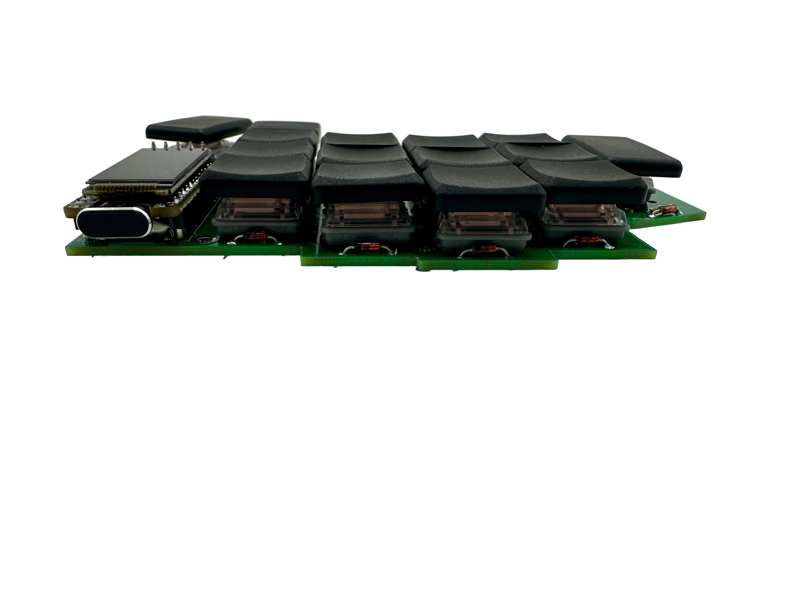
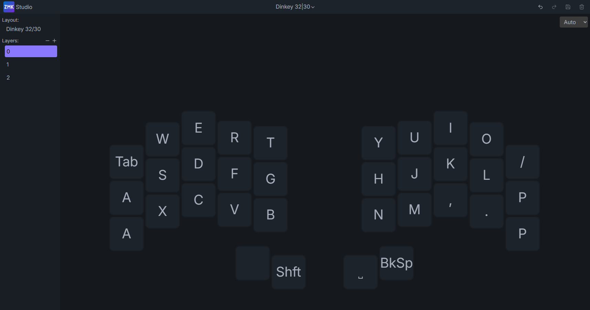
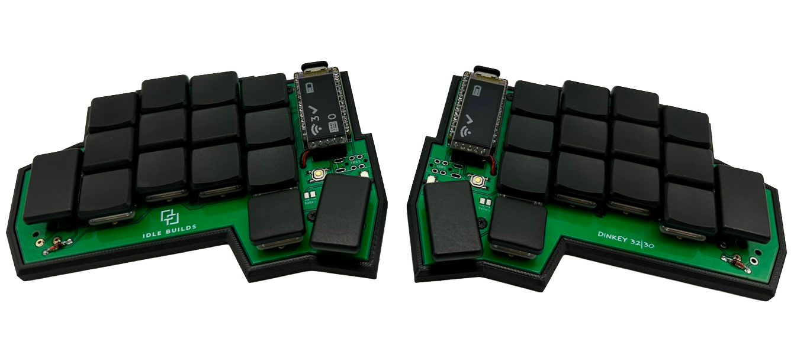
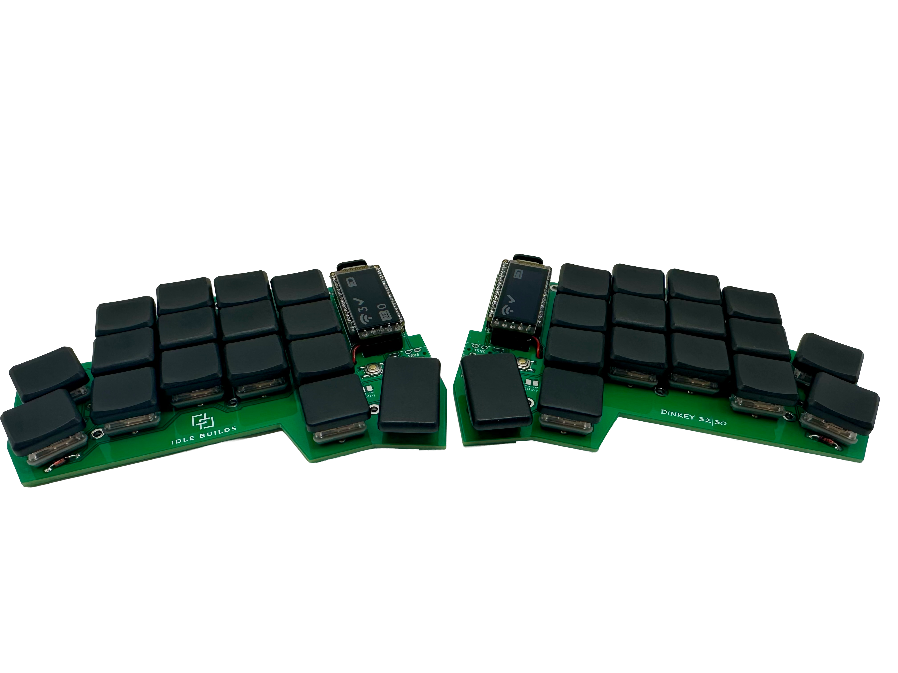
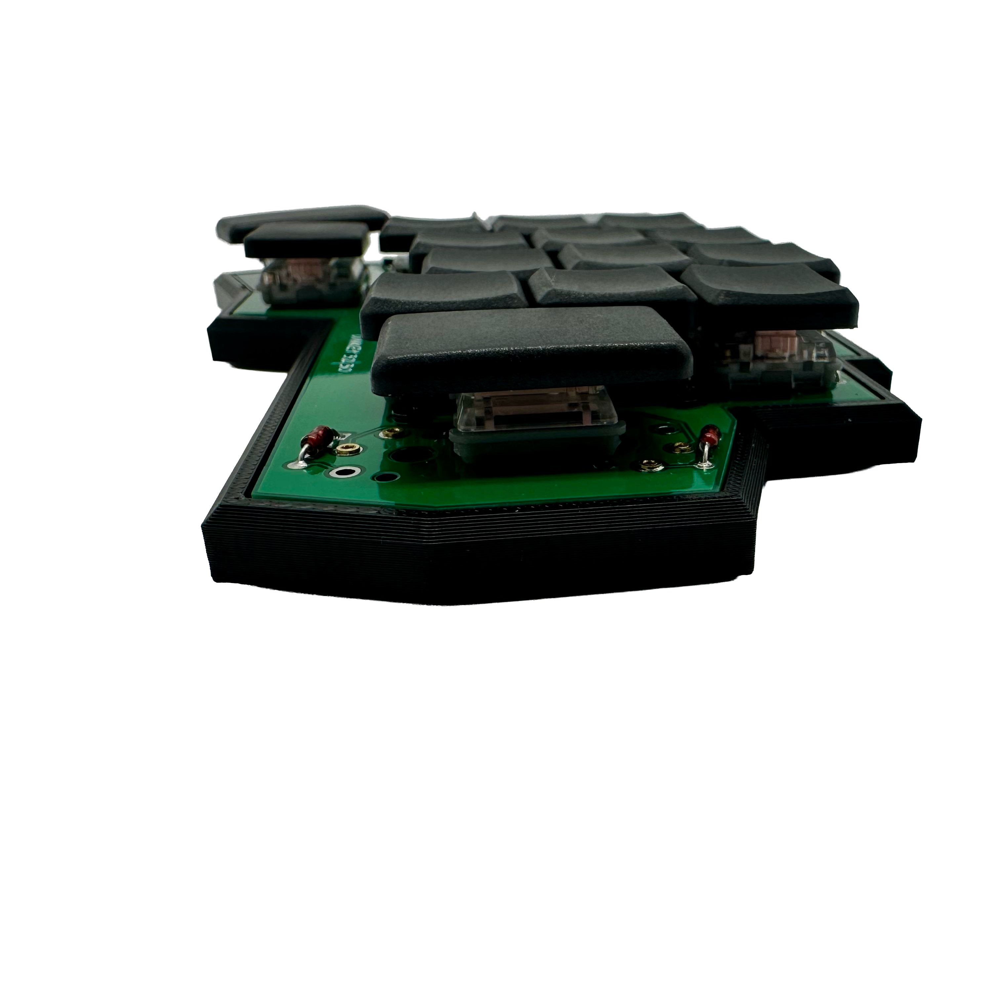
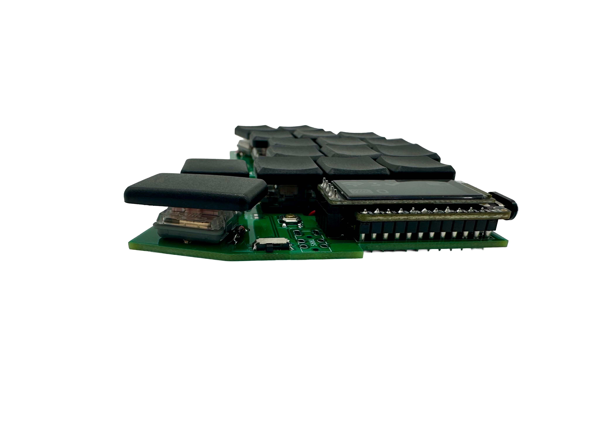

# Dinkey 32|30 — ZMK Firmware

ZMK firmware config for the Dinkey 32|30. Runs on the nice!nano v2 with optional nice!view display.

[](docs/images/dinkey_32_30_zmk_front.png)

---

## Hardware

- **MCU:** nice!nano v2 (hotswap socket)
- **Display:** nice!view (optional, hotswap)
- **Switches:** Kailh Choc v1 hotswap
- **Layout:** 3×5+2 split, 30 or 32 keys depending on pinky column population

---

## About the PCB

The 32|30 has a modular 4th pinky column that accepts one or two switches with zero firmware changes. Populate both for 32 keys or one for 30.

There is no other board with a modular pinky column. It allows for an easy transition from a 32-key layout down to a 30-key layout without committing to a new board or reflashing anything.

---

## Flashing

Each build produces three `.uf2` files:

| File | What it's for |
|---|---|
| `dinkey_32_30_left-...uf2` | Left half |
| `dinkey_32_30_right-...uf2` | Right half |
| `settings_reset-...uf2` | Clears BT pairing data |

Download the latest from the **Actions** tab → most recent run → **Artifacts**.

**To flash:**
1. Unzip the artifact
2. Plug in the left half via USB
3. Double-tap the reset button on the nice!nano — it'll show up as a `NICENANO` drive
4. Drag `dinkey_32_30_left-...uf2` onto the drive
5. Repeat for the right half

Flash the left first. The right connects to the left over BLE.

**To reset Bluetooth pairing:**
Flash `settings_reset-...uf2` to both halves, then reflash normal firmware.

---

## ZMK Studio

No code required. ZMK Studio lets you remap keys visually in your browser.

[](assets/dinkey_3230_zmkstudio.png)

**What you need:**
- Left half connected via USB
- Chrome or Edge (Chromium-based)
- [studio.zmk.dev](https://studio.zmk.dev)

**Steps:**
1. Plug in the left half
2. The board defaults to BLE. Switch to USB output by pressing the output toggle on Layer 2
3. Open [studio.zmk.dev](https://studio.zmk.dev) and click Connect
4. Select the Dinkey 32|30 from the device list
5. Press **T + Y** at the same time to unlock Studio (inner top-row keys, positions 4 and 5 — always present regardless of pinky column config)
6. Remap away — changes save to the keyboard automatically

---

## Default Layout

Layer 0 — Base

```
┌─────┬───┬───┬───┬───┬───┐   ┌───┬───┬───┬───┬─────┐
│ Tab │ W │ E │ R │ T │   │   │   │ Y │ U │ I │  O  │
├─────┼───┼───┼───┼───┤   │   │   ├───┼───┼───┼─────┤
│  A  │ S │ D │ F │ G │   │   │   │ H │ J │ K │  L  │
├─────┼───┼───┼───┼───┤   │   │   ├───┼───┼───┼─────┤
│  A  │ X │ C │ V │ B │   │   │   │ N │ M │ ' │  /  │
└─────┴───┴───┴───┼───┤   │   │   ├───┼───┴───┴─────┘
                  │SFT│   │   │BSP│
                  └───┘   │   └───┘
                    └─────┘
```

> Pinky column shown populated with 2 keys (32-key config). Leave one or both unpopulated for 30-key.

3 layers total. Layer 2 has Bluetooth profile switching, BT clear, and the output toggle (BLE ↔ USB).

---

## Gallery

| 32-key ZMK | 30-key ZMK |
|---|---|
| [](docs/images/dinkey_32_30_32_key_config_zmk.png) | [](docs/images/dinkey_32_30_30_key_config_zmk.png) |

| 32-key QMK | 30-key QMK |
|---|---|
| [](docs/images/dinkey_32_30_32_key_config_qmk.png) | [](docs/images/dinkey_32_30_30key_config_qmk.png) |

| No case (32-key) | No case (30-key) |
|---|---|
| [](docs/images/dinkey_32_30_32_key_no_case.png) | [](docs/images/dinkey_32_30_30_key_no_case.png) |

| Side profile (32-key) | Side profile (30-key) |
|---|---|
| [](docs/images/dinkey_32_30_32_key_side.png) | [](docs/images/dinkey_32_30_30_key_side.png) |

| Controller / nice!view | Case (bottom) | PCB |
|---|---|---|
| [](docs/images/dinkey_32_30_no_case_controller.png) | [](docs/images/dinkey_32_30_case.png) | [](docs/images/dinkey_32_30_naked.png) |

---

## Repo Structure

```
config/
  boards/shields/dinkey_32_30/
    dinkey_32_30.dtsi            ← Row/col pin definitions for the 32|30 PCB
    dinkey_32_30_left.overlay    ← Left half wiring
    dinkey_32_30_right.overlay   ← Right half wiring
    dinkey_32_30.zmk.yml
    Kconfig.shield
    Kconfig.defconfig
  dinkey_32_30.keymap
  dinkey_32_30.conf
build.yaml
```

---

## Building Locally

```bash
west build -s app -b nice_nano/nrf52840/zmk \
  -d build/left \
  -- -DSHIELD="dinkey_32_30_left nice_view_adapter nice_view" \
     -DCONFIG_ZMK_STUDIO=y \
     -DSNIPPET=studio-rpc-usb-uart
```

Studio is enabled on the left half only.

---

## Related

- [Dinkey 34 ZMK config](https://github.com/IdleBuilds/zmk-config-dinkey_34)
- [Main repo](https://github.com/IdleBuilds/Dinkey)
- [idlebuilds.com](https://idlebuilds.com)
- [ZMK docs](https://zmk.dev/docs) · [ZMK Studio](https://studio.zmk.dev)
